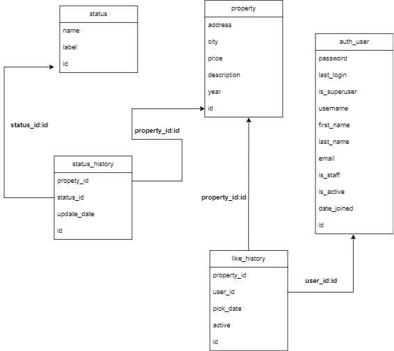

# Test Habi :heart:

En este programa se resolverá la prueba para backend developer de Habi a cargo de **Carlos Felipe Baquero**.

## Tabla de Contenidos

- [Test Habi :heart:](#test-habi-heart)
  - [Tabla de Contenidos](#tabla-de-contenidos)
  - [Instalación](#instalación)
  - [Tecnologías](#tecnologías)
  - [Dudas](#dudas)
  - [Modelo like :+1:](#modelo-like-1)
- [Instrucciones para crear el modelo](#instrucciones-para-crear-el-modelo)
- [Sugerencias para mejorar el modelo](#sugerencias-para-mejorar-el-modelo)
- [Pruebas Unitarias](#pruebas-unitarias)

## Instalación

Para instalar el proyecto, sigue estos pasos:

1. Clona el repositorio: `git clone https://github.com/Tu_usuario/Habi-test.git`
2. Entra en el directorio del proyecto: `cd carpeta del proyecto`
3. Crear entorno virtual  `python -m venv venv_name`
4. Activar el entorno virtual `venv_name\Scripts\activate`
5. Instala las dependencias: `pip install -r requiriment.txt`
6. Crea las variables de entorno en tu sistema: `host_test ,port_test ,user_test ,pass_test ,database_test`
   1. las variables de entorno deben tener los datos de la cadena de conexion.
7. Una vez tengas configurado las variables de entorno ejecuta el comando `python api_main.py`
   1. lo que provocara que los servicios ya esten en tu **localhost** puerto **8080**
   2. si deseas modificar el puerto se encuntra en el archivo [api_main.py](api_main.py) variable **port**

## Tecnologías

1. [Python](https://www.python.org/doc/): Lenguaje de programación en el cual se desarrolló la prueba dados los requerimientos.
2. [Http.server](https://docs.python.org/3/library/http.server.html): Módulo de python que nos permite crear un servidor sencillo web HTTP, se utilizó este módulo por lo practico y sencillo de implementar, es una solucion rapida que permite una concurrencia basica.
3. [Mysql Connnector](https://dev.mysql.com/doc/connector-python/en/): utilizamos este conector dado que es un conector oficial para trabajar con [MySQl](https://www.mysql.com/), algunas de las razones por las cuales utilizamos este conector es por el soporte oficial que tiene y la documentación completa que posee aprovechando así las funcionalidades completas especificas de [MySQl](https://www.mysql.com/).
4. [Json](https://www.json.org/json-en.html): formato ligero para manejo de comunicación con los servicios.

## Dudas
1. Utilizar la libreria **Sockets** o **Http.server**
   1. Al final me decanté por usar http.server para un manejo más sencillo de las conexiones, ya que usar sockets era más para otros requerimientos y control de cargas.
2. Hacer las variables para la conexión  a la base de datos como variables de entorno
   1. Si dado que trabajar con variables de conexión públicas hace el código inseguro.
3. Que conector usar para la base de datos
   1. **MySql Connector** dado que es el oficial y tiene soporte completo con bases de datos **MySql**, lo que nos permite tener una documentación clara en caso de que surja cualquier duda.
4. Como hacer la consulta a la bd dinámica para que no consuma tantos recursos y a su vez sea funcional para el primer requerimiento
   1. relaizar una serie de join para optimizar el consumo de la base de datos y a su vez hacer concatenación de strigns para realizar filtros dinámicos según los requerimientos del proyecto.

## Modelo like :+1:

[fig1](##esquema)

-En este modelo entidad relación lo que representamos es la forma de soportar el sistema de like propuesto, pensando en tener una referencia del usuario que le da like a la propiedad, este modelo consta cinco campos, dos de ellos llaves foráneas referentes a la propiedad y al usuario(property_id,user_id), uno para saber la fecha que se le dio like y otro para saber si el like sigue activo.
- Permitir que solo los usuarios registrados puedan dar like, ya que si no existe el usuario no podrá llenarse el campo de `user_id`
- Permite que los likes puedan ser desactivados para que el usuario pueda quitar el like
- Permite tener el histórico de a qué propiedades se le ha dado más o menos like
- Permite tener el histórico de a qué propiedades le dio like un usuario en específico
- Permite saber en qué fecha se le dio like a una propiedad o en que fecha se le dio más likes a una propiedad
# Instrucciones para crear el modelo
1. Asegúrate de que las tablas "**property**" y "**auth_user**" existan previamente y tengan las columnas "**id**" correspondientes
2. Ejecutá la siguiente sentencia `CREATE TABLE like_history (
    id INT AUTO_INCREMENT PRIMARY KEY,
    property_id INT,
    user_id INT,
    pick_date DATE,
    active_state BOOLEAN,
    FOREIGN KEY (property_id) REFERENCES property(id),
    FOREIGN KEY (user_id) REFERENCES auth_user(id)
);`

# Sugerencias para mejorar el modelo
1. En general al ser un modelo reducido no debería haber inconvenientes al usarlo; sin embargo, si se extiende este modelo junto a otras tablas y la información creciera, deberían analizar los siguientes consejos para mejorar esta arquitectura
2. Considerar el uso de índices, por ejemplo para la tabla property en los filtros más usados; sin embargo, tener cuidado al crear estos filtros y solo crear los necesarios para que tampoco se vea afectado el rendimiento en la escritura de esta tabla
3. Partición de las tablas que crezcan de más, en específico si una tabla tiene demasiados registros, lo mejor es particionar estas tablas para mejorar el rendimiento haciendo así que algunas particiones de las tablas puedan archivarse, yo analizaría esta posibilidad para las tablas como status_history, ya que es probable que un futuro se llene de registros muy antiguos que ya no se usen, pero sea importante almacenarlos.

# Pruebas Unitarias
* Se realizaron pruebas unitarias para las funciones del codigo mas importantes estas prubas se dividieron en dos archivos [test_unit_api.py](test_unit_api.py) el cual contien las pruebas de los endpoint y otro llamado [test_unit.py](test_unit.py)